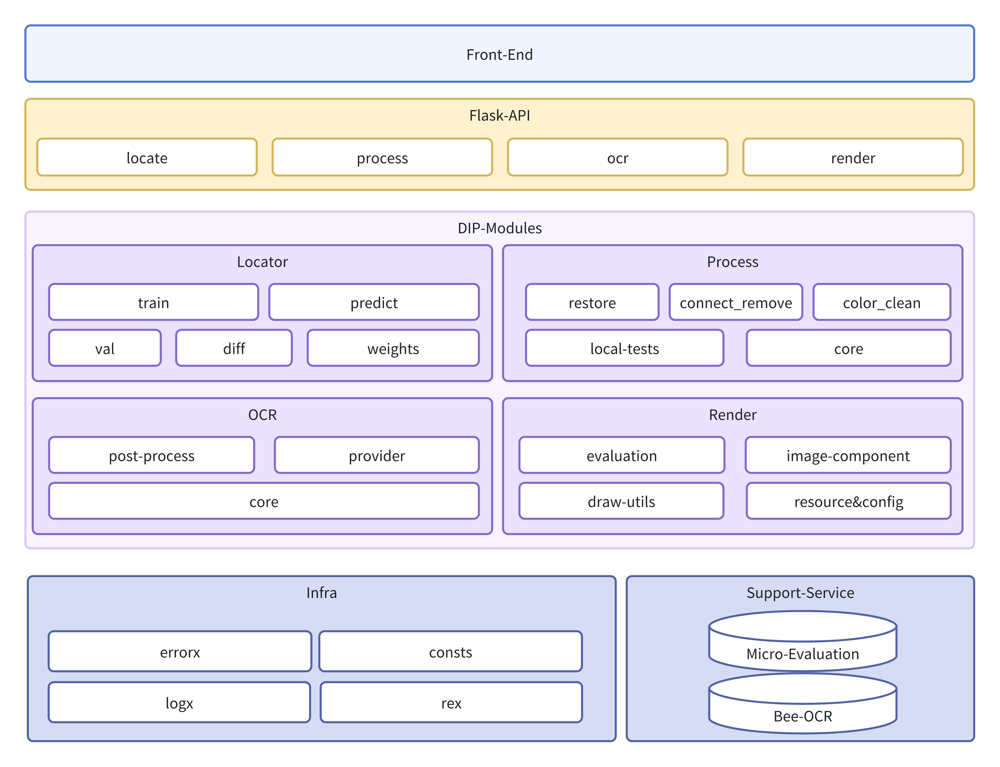
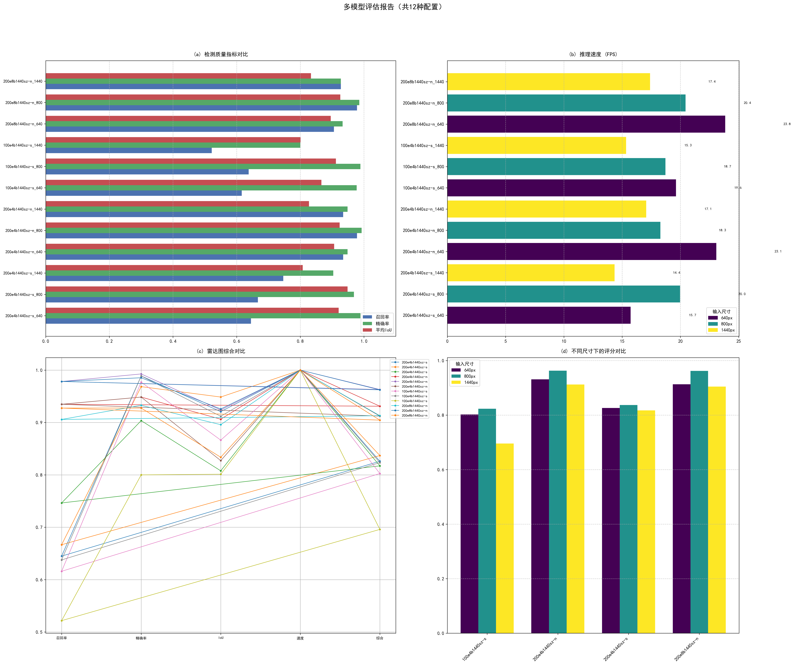
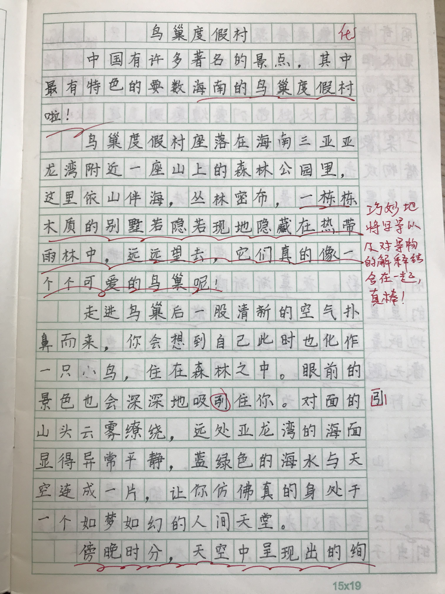
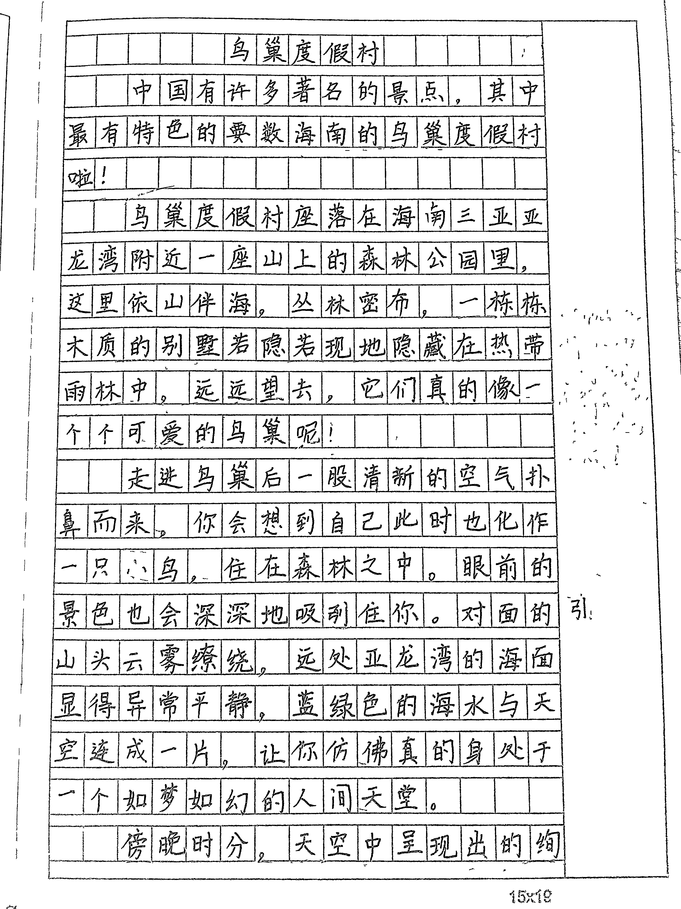

# Essay-Eval作文批改系统

## 概述

本项目是综合运用各种数字图像处理技术, 并结合现有的作文批改能力实现的作文批改系统
用户上传作文图片, 经过定位, 处理, 识别, 批改, 渲染等流程后可以得到画面精美, 内容详实的批改结果

## 架构



## 核心模块

项目总共四个核心模块, 依次为Locator定位器, Processor 预处理器, OCR 识别器, Render 渲染器

### Locator 定位器

Locator 模块基于 YOLO 11 实现定位并切分作文图片中的标题与正文区域, 通过目标检测技术弥补OCR模块缺乏的区域识别与分类能力；

我们通过以下工作实现此功能：
- 1.自制作文数据集

  采集近千张真实场景下作文图像样本，使用LabelImg人工标注，构建了目标检测模型训练用数据集

- 2.训练目标检测模型

  基于YOLOv11基础模型，通过调整模型尺寸和超参数配置，训练生成了一个多尺度的检测模型族

- 3.预测结果后处理

  对模型预测结果中区域重叠等边界情况进行优化处理，提升模型检测精度

- 4.可视化评测工具

  编写模型评测工具，批量进行多尺寸输入下的性能分析，通过可视化直观呈现不同模型的精度、性能差异

- 模块构成
  ```
  ├── resource/                  # 静态资源
  │   ├── dataset/               # 数据集
  │   │   ├── train/             # 训练集
  │   │   ├── val/               # 测试集
  │   │   └── data.yaml          # 数据集配置
  │   └── weights/               # 模型权重集合
  ├── train.py                   # 训练代码（默认使用device-0，需Nvidia显卡与CUDA驱动）
  ├── locator.py                 # 推理代码（默认使用device-0，需Nvidia显卡与CUDA驱动）
  ├── locator_test.py            # 推理测试代码（返回切割图与原图等可视化对比）
  ├── val.py                     # 批量测试代码（批量推理测试效率）
  └── diff.py                    # 模型性能对比（批量对比不同模型在不同输入尺寸下的效果）
  ```

- 模型能力对比 [模型评分](asset/locator/diff/model_metrics.json) 
- 定位结果展示 

### Processor 预处理器

Processor 模块心功能是通过一系列经典的数字图像处理方法去除非作文内容干扰（涂改、教师批注等）并提升文字区域可读性，以弥补OCR模块抗干扰能力弱的缺陷。

通过以下几个步骤的处理，我们实现了异色批注去除，形态学去噪
以及自适应二值化，连通域过滤的功能：

- 1.异色批注去除

  使用INPAINT_TELEA算法，根据待修复区域边界的梯度信息，对红蓝色区域进行基于邻域加权平均的替换

- 2.自适应二值化

  根据像素邻域的高斯加权均值计算动态阈值，从而实现光照不均图片的高质量二值化

- 3.连通域过滤

  基于8-连通域分析，通过面积阈值过滤消除散粒噪声区域，实现二值图像的降噪。

- 4.形态学去噪

  通过开运算消除细小噪声、闭运算弥合断裂笔画、膨胀操作与掩膜重建实现笔画连续性增强

- 模块构成
  ```
  ├── restore/                   # 图像恢复工具, 暂时没有实际使用
  ├── local_tests.py             # 本地测试工具, 用于测试处理效果
  ├── process_utils.py           # 自定义处理工具(包括颜色去除, 连通域分析等)
  └── processor.py               # 预处理器核心部分, 组织各处理流程以及定义相关接口
  ```
- 处理效果样例
    - 处理前
    - 处理后(实际使用时, 侧边栏中多余字符与噪声在locate阶段会被去除)
      

### OCR

OCR 模块通过调用Essay-Stateless中台的OCR接口实现文字识别, 同时通过自定义的后处理工具，如中英字符转换与冗余去除等增强OCR的识别效果。

[Essay-Stateless:OCR模块](https://github.com/xh-polaris/essay-stateless/tree/main/src/main/java/com/xhpolaris/essay_stateless/ocr)
是Java实现的中台服务, 可以集成多供应商的OCR能力, 并且能够根据供应商特性实现如印刷字体去除等增强功能

- 模块构成
  ```
  ├── bee.py                   # BeeOCR客户端, 调用OCR中台服务
  ├── post.py                  # OCR后处理工具, 用于对OCR结果进一步校正(核心是中英字符处理)
  └── ocr.py                   # OCR核心部分, 组织处理流程并定义相关接口
  ```

### Evaluate

Evaluate 模块通过调用批改服务的接口实现作文批改功能, 并通过建造者模式构造渲染模块需要的对象组织形式

- 模块构成
  ```
  ├── evaluator.py             # Evalutate核心部分, 组织批改流程并定义相关接口
  ├── micro_evalu.py           # 定义micro版本批改算法的对象结构
  └── micro_builder.py         # micro版本建造者, 构建render所需对象
  ```

### Render

Render模块负责将批改的结果渲染为画面美观，标注详细的类手写形式作文纸。

此模块实现了以下几点功能：

- 1.自适应页面布局

  根据作文篇幅、批注内容自适应调整页面布局，以优化元素排版

- 2.防重叠页面组件

  定义GRID、SIDEBAR、PARA等组件，并维护待绘制任务队列，动态调整元素绘制坐标，有效避免重叠

- 3.自定义绘图工具

  实现多行文本、波浪线及虚线绘制等高级绘制特性，扩展PIL库的图像处理能力

- 4.A4比例分页能力

  支持在保护元素完整性前提下，将渲染长图按A4比例切分为多张图片，以适配打印需求

```
├── resource/                  # 静态资源（如字体文件等）
├── components.py              # 渲染图内容组件定义
├── config.py                  # 渲染图各部分尺寸定义
├── draw_utils.py              # 自定义绘图工具（包括波浪线、多行文字等）
└── render.py                  # 渲染核心类（负责各组件的组织与绘制）
```

渲染结果样例


## 部署方式

前端位于端口5173, 后端位于端口5000, 需预先避免端口占用

### 后端

- 依赖安装
    - 开发使用的python版本为3.12.9, 所依赖的库均在requirements.txt中指出
    - plus: 训练和推理都用到了Nvidia的GPU, 需要安装gpu版本的torch
- 启动
    - 开发环境: 直接用python运行app.py即可
    - 正式环境: 建议使用Gunicorn部署

### 前端

- 依赖安装
    - 使用npm作为包管理器, npm install即可
- 启动
    - npm run dev即可以开发模式部署, 用于测试
    - 若需要构建, 则使用npm run build
